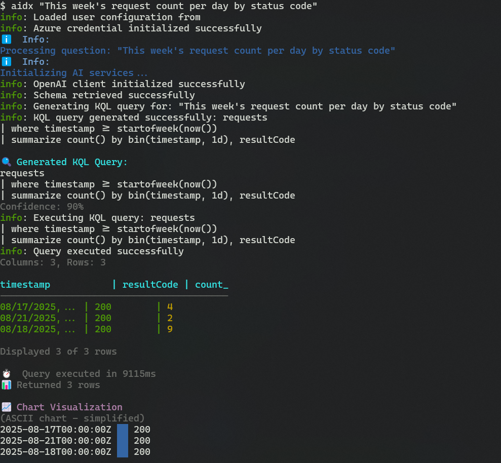

# 🔍 AppInsights Detective 🕵

[](https://github.com/georgeOsdDev/AppInsightsDetective/actions/workflows/ci.yml)
[](https://nodejs.org/)
[](https://opensource.org/licenses/MIT)

**Query Azure Application Insights with natural language using AI**

AppInsights Detective is an intelligent CLI tool that allows you to query your Azure Application Insights data using natural language. It leverages Azure OpenAI to convert your questions into KQL (Kusto Query Language) queries and presents the results in a user-friendly format.



## ✨ Features

- 🗣️ **Natural Language Queries**: Ask questions in plain English/Japanese
- 🤖 **AI-Powered KQL Generation**: Automatic conversion to KQL using Azure OpenAI
- 🌐 **External Query Execution**: Open queries directly in Azure Portal or Data Explorer
- 📊 **Rich Visualization**: Console-based charts and formatted tables ⚠️ **(Chart features are experimental)**
- 📁 **Multiple Output Formats**: JSON, CSV, TSV, Raw, and Table formats
- 💾 **File Export**: Save results to files with configurable encoding
- 🔐 **Secure Authentication**: Uses Azure Managed Identity
- ⚡ **Interactive Mode**: Step-by-step query building and validation
- 📈 **Query Validation**: Ensures safe and valid KQL execution
- 🎯 **Smart Schema Integration**: Leverages your Application Insights schema
- 🧹 **Smart Column Hiding**: Automatically hides empty columns for cleaner output
- 🧪 **Comprehensive Testing**: Full test coverage with automated CI/CD
- 🚀 **Production Ready**: Built with TypeScript, proper error handling

## 🚀 Quick Start

### Prerequisites

- Node.js 18.0.0 or higher
- Azure Application Insights resource
- Azure OpenAI resource
- Appropriate Azure permissions

### Installation

> **Note**: This package is currently in development. For now, please install from source.

```bash
# Install from npm (coming soon)
npm install -g appinsights-detective
```

**Install from source:**

```bash
git clone https://github.com/georgeOsdDev/AppInsightsDetective.git
cd AppInsightsDetective
npm install
npm run build
```

### Setup

1. Configure your Azure resources:

```bash
aidx setup
```

2. Check your configuration:

```bash
aidx status
```

### Usage

**Ask questions naturally:**

```bash
aidx "Show me errors from the last 24 hours"
aidx "What are the slowest requests today?"
aidx "How many users visited my app this week?"
```

**Interactive mode:**

```bash
aidx -i
# or
aidx --interactive
```

**Raw KQL queries:**

```bash
aidx query --raw "requests | take 10"
```

## 📋 Commands

| Command | Description |
|---------|-------------|
| `aidx setup` | Configure Application Insights and OpenAI settings |
| `aidx status` | Check configuration and connection status |
| `aidx query [question]` | Query with natural language |
| `aidx -i` or `aidx --interactive` | Interactive query mode |
| `aidx query --raw [kql]` | Execute raw KQL query |

### External Execution Commands

AppInsights Detective can open generated queries directly in Azure Portal and Data Explorer:

| Command | Description |
|---------|-------------|
| `aidx --external [question]` | Interactive external tool selection |
| `aidx --open-portal [question]` | Open query directly in Azure Portal |
| `aidx --open-dataexplorer [question]` | Open query in Azure Data Explorer |

### Query Command Options

The `aidx query` command supports various options for customizing output and behavior:

| Option | Description | Default |
|--------|-------------|---------|
| `--format <format>` | Output format: table, json, csv, tsv, raw | table |
| `--output <file>` | Save results to file | - |
| `--pretty` | Pretty print JSON output | false |
| `--no-headers` | Exclude headers in CSV/TSV output | false |
| `--encoding <encoding>` | File encoding (utf8, utf16le, etc.) | utf8 |
| `--show-empty-columns` | Show all columns including empty ones | false |
| `--raw` | Execute raw KQL query instead of natural language | false |
| `--direct` | Execute query directly without confirmation | false |
| `--language <lang>` | Language for explanations (en, ja, ko, etc.) | en |
| `--external` | Show external execution options interactively | false |
| `--open-portal` | Open generated query directly in Azure Portal | false |
| `--open-dataexplorer` | Open query in Azure Data Explorer | false |

## 📁 Output Formats & Display Options

AppInsights Detective supports multiple output formats for both console display and file export:

### Output Formats
- **table** (default) - Colored console display with ASCII charts for numeric data ⚠️ **(Chart visualization is experimental)**
- **json** - Structured JSON format with optional pretty printing
- **csv** - Comma-separated values for spreadsheet import  
- **tsv** - Tab-separated values for data processing tools
- **raw** - Human-readable debug format showing table structure

### Smart Column Management
By default, AppInsights Detective automatically hides empty columns in table output to improve readability:
- **Empty columns** (containing only null, undefined, empty strings, or whitespace) are hidden
- **Column summary** shows how many columns were hidden: `"3 columns displayed, 2 empty columns hidden"`
- Use `--show-empty-columns` flag to display all columns including empty ones

### Usage Patterns
- **Console only**: Use `--format` to display results in the specified format to console
- **File output**: Use `--output` with optional `--format` to save results to file
- **Both**: When `--output` and `--format table` are used, results display to console AND save to file

### File Export Options
- **--output** - Save results to file (auto-detects format from extension)
- **--format** - Specify output format (works with or without file output)
- **--pretty** - Enable pretty-printed JSON output
- **--no-headers** - Exclude column headers in CSV/TSV output
- **--encoding** - File encoding (utf8, utf16le, ascii, latin1, base64)
- **--show-empty-columns** - Show all columns including empty ones

## ⚙️ Configuration

### Option 1: Interactive Setup

```bash
aidx setup
```

### Option 2: Environment Variables

```bash
export AZURE_APPLICATION_INSIGHTS_ID="your-app-insights-id"
export AZURE_TENANT_ID="your-tenant-id"
export AZURE_OPENAI_ENDPOINT="https://your-openai.openai.azure.com/"
export AZURE_OPENAI_DEPLOYMENT_NAME="gpt-4"
```

### Option 3: Configuration File

Create `~/.aidx/config.json`:

```json
{
  "appInsights": {
    "applicationId": "your-application-insights-id",
    "tenantId": "your-azure-tenant-id"
  },
  "openAI": {
    "endpoint": "https://your-openai.openai.azure.com/",
    "deploymentName": "gpt-4"
  },
  "logLevel": "info"
}
```

## 🔄 Output Format Examples

### Console Output
```bash
# Table format with smart column hiding (default)
aidx "Show me top 10 requests"  # Automatically hides empty columns

# Table format showing all columns including empty ones
aidx "Show me top 10 requests" --show-empty-columns

# JSON format to console
aidx "Show me errors" --format json

# CSV format to console  
aidx "Show request counts" --format csv

# Pretty-printed JSON to console
aidx "Show me errors" --format json --pretty
```

### Smart Column Hiding Examples
```bash
# Default behavior - cleaner output with empty columns hidden
aidx "Show request performance data"
# Output example:
# request_name       | count | avg_duration
# -----------------------------------------
# GET /api/health    | 1250  | 45.2
# POST /api/login    | 890   | 156.8
# 
# Displayed 2 of 3 rows (3 columns displayed, 2 empty columns hidden)

# Show all columns including empty ones
aidx "Show request performance data" --show-empty-columns
# Output example:
# request_name       | count | empty_field | unused_col | avg_duration
# --------------------------------------------------------------------
# GET /api/health    | 1250  | null        | (empty)    | 45.2
# POST /api/login    | 890   | null        | (empty)    | 156.8
```

### JSON Export
```bash
# Pretty-printed JSON
aidx "Show me errors" --output errors.json --format json --pretty

# Compact JSON  
aidx "Show me errors" --output errors.json --format json
```

### CSV Export
```bash
# With headers (default)
aidx "Show request counts" --output requests.csv --format csv

# Without headers for data processing
aidx "Show request counts" --output requests.csv --format csv --no-headers
```

### TSV Export
```bash
# Tab-separated values
aidx "Performance data" --output perf.tsv --format tsv

# Custom encoding for international data
aidx "User data" --output users.tsv --format tsv --encoding utf16le
```

## 🔐 Authentication

AppInsights Detective uses Azure Managed Identity for secure authentication. Ensure you have the following permissions:

- **Application Insights**: Reader role
- **OpenAI**: Cognitive Services OpenAI User role

## ⚠️ Experimental Features

### Chart Visualization
The ASCII chart visualization feature is currently **experimental**. While it provides visual insights into your Application Insights data, CLI-based charts may not always be the most intuitive way to understand complex data patterns. Consider using additional visualization tools for detailed analysis.

## 🌐 External Query Execution

AppInsights Detective can open generated KQL queries directly in Azure Portal and Azure Data Explorer, allowing you to leverage advanced visualization capabilities and share queries with your team.

### Prerequisites for External Execution

To use external execution features, configure the following during setup:
- Azure Subscription ID
- Resource Group Name
- Application Insights Resource Name
- (Optional) Azure Data Explorer Cluster ID and Database Name

### Usage Examples

```bash
# Interactive external execution - shows available options
aidx --external "show me errors from last hour"

# Open directly in Azure Portal Application Insights
aidx --open-portal "performance issues in last 24 hours"

# Open in Azure Data Explorer (if configured)
aidx --open-dataexplorer "detailed request analysis"

# Combined with other options
aidx --open-portal --raw "requests | where resultCode >= 400 | count"
```

### Features
- **URL Generation**: Creates pre-populated query URLs for external tools
- **Browser Integration**: Automatic browser launching with authentication context
- **URL Display**: Shows generated URLs for manual copying/sharing
- **Configuration Validation**: Checks Azure resource information before execution
- **Cross-Platform**: Works on Windows, macOS, and Linux

### Interactive Flow Enhancement

When using step-by-step query review mode, you'll see a new option:

```
🔍 Generated KQL Query Review
==========================================
requests | where timestamp > ago(1h) | count

✅ Execute Query - Run this KQL query against Application Insights
📖 Explain Query - Get detailed explanation of what this query does
🌐 Open in External Tools - Execute query in Azure Portal or Data Explorer
🔄 Regenerate Query - Ask AI to create a different query approach
```

## 💡 Example Queries

```bash
# Performance Analysis
aidx "What are the slowest API endpoints?"
aidx "Show me response times over the last hour"

# Error Investigation
aidx "List all exceptions from today"
aidx "Which pages have the most errors?"

# User Analytics
aidx "How many unique users today?"
aidx "What browsers are users using?"

# Custom Metrics
aidx "Show me custom events by type"
aidx "What's the trend for failed logins?"

# External Execution Examples
aidx --external "show me errors from last hour"              # Interactive selection
aidx --open-portal "performance issues in APIs"              # Direct Azure Portal
aidx --open-dataexplorer "detailed request analysis"         # Azure Data Explorer
aidx --open-portal --raw "requests | where resultCode >= 400" # Portal with raw KQL

# Smart Column Display (Default - Empty columns hidden)
aidx "Show me request data"  # Hides columns with all null/empty values

# Show All Columns Including Empty Ones
aidx "Show me request data" --show-empty-columns  # Shows all columns

# Output to JSON file with pretty printing
aidx "Show me errors from last hour" --output errors.json --format json --pretty

# Export to CSV for spreadsheet analysis
aidx "Show request counts by operation" --output requests.csv --format csv

# Save to TSV without headers for data processing
aidx "Performance metrics" --output metrics.tsv --format tsv --no-headers

# Custom encoding for international data
aidx "User data" --output users.csv --format csv --encoding utf16le

# Console output with visualization (default behavior)
aidx "Show top 10 requests"  # displays table + ASCII chart for numeric data

# Interactive Mode Examples
aidx -i  # Start interactive session with guided queries
aidx --interactive  # Full interactive mode with step-by-step assistance
```

## 🏗️ Development

### Setup Development Environment

```bash
git clone https://github.com/georgeOsdDev/AppInsightsDetective.git
cd AppInsightsDetective
npm install
npm run dev
```

### Available Scripts

```bash
npm run build        # Compile TypeScript
npm run dev          # Run in development mode
npm run lint         # Run ESLint
npm run lint:fix     # Fix ESLint issues
npm run test         # Run unit tests
npm run test:watch   # Run tests in watch mode
npm run test:coverage # Run tests with coverage
npm run clean        # Clean build directory
```

### Project Structure

```
AppInsightsDetective/
├── src/
│   ├── cli/                # CLI command definitions
│   │   ├── commands/       # Individual commands (setup, query, status)
│   │   └── index.ts        # CLI entry point
│   ├── services/           # Business logic
│   │   ├── authService.ts          # Azure authentication
│   │   ├── appInsightsService.ts   # Application Insights API
│   │   ├── aiService.ts            # OpenAI integration
│   │   ├── stepExecutionService.ts # Interactive query execution
│   │   └── interactiveService.ts   # Interactive CLI service
│   ├── utils/              # Utilities
│   │   ├── config.ts       # Configuration management
│   │   ├── logger.ts       # Logging
│   │   └── visualizer.ts   # Console visualization
│   └── types/              # TypeScript definitions
├── tests/                  # Unit and integration tests
│   ├── services/           # Service tests
│   ├── utils/              # Utility tests
│   └── integration/        # Integration tests
├── .github/workflows/      # GitHub Actions CI/CD
├── config/                 # Configuration files
└── templates/              # Query templates
```

## 🤝 Contributing

1. Fork the repository
2. Create a feature branch
3. Make your changes
4. Add tests for new functionality
5. Run tests: `npm test`
6. Run linting: `npm run lint`
7. Submit a pull request

All contributions must pass the CI checks including tests and linting.

## 📝 License

MIT License - see [LICENSE](LICENSE) file for details.

## 🐛 Troubleshooting

### Common Issues

**Authentication Failed**
- Ensure you're logged into Azure CLI: `az login`
- Check your Azure permissions
- Verify Managed Identity configuration

**OpenAI Connection Failed**
- Confirm your OpenAI endpoint URL
- Check deployment name matches your Azure OpenAI resource
- Verify network connectivity

**Application Insights Access Denied**
- Ensure correct Application Insights ID
- Check Reader permissions on the resource
- Verify tenant ID is correct

### Debug Mode

Enable detailed logging:

```bash
export LOG_LEVEL=debug
aidx status
```

## 📞 Support

For issues and questions:
- Check the [troubleshooting guide](#troubleshooting)
- Review [Azure documentation](https://docs.microsoft.com/azure/azure-monitor/app/app-insights-overview)
- Create an issue in this repository

---

**Built with ❤️ for Azure developers**
