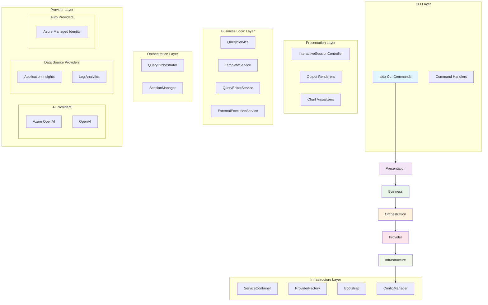
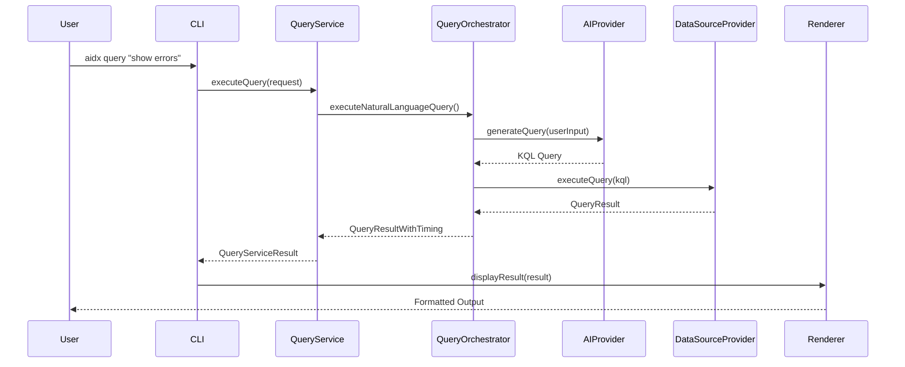
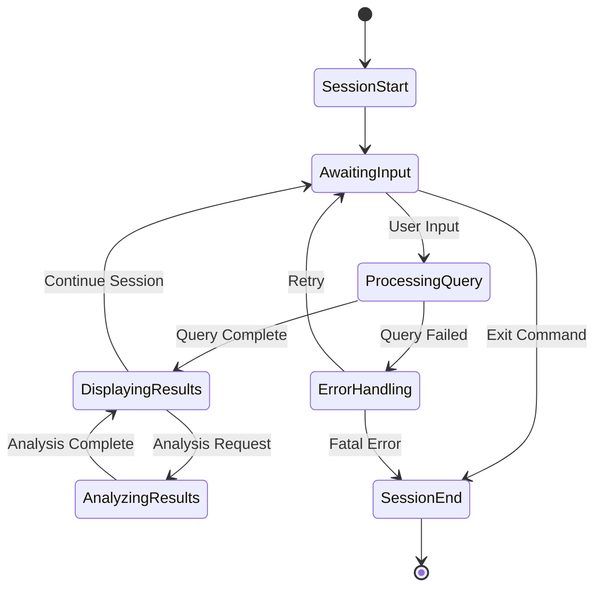
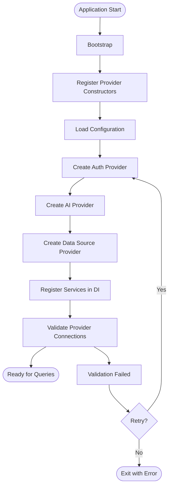

# AppInsights Detective - Architecture Overview

This document provides a comprehensive overview of the AppInsights Detective architecture, including system layers, data flows, design patterns, and extension points for developers.

## Table of Contents
- [System Overview](#system-overview)
- [Architecture Layers](#architecture-layers)
- [Data Flow Diagrams](#data-flow-diagrams)
- [Key Design Patterns](#key-design-patterns)
- [Extension Points](#extension-points)
- [Component Details](#component-details)

## System Overview

AppInsights Detective follows a layered architecture pattern with clear separation of concerns. The system is designed to be extensible, testable, and maintainable through dependency injection and provider-based architecture.



## Architecture Layers

### 1. CLI Layer
**Location**: `/src/cli/`

The CLI layer handles user interface and command parsing using Commander.js.

**Key Components:**
- **CLI Entry Point** (`index.ts`): Main CLI application entry
- **Command Handlers** (`commands/`): Individual command implementations
  - `query.ts` - Natural language query execution
  - `setup.ts` - Configuration setup
  - `status.ts` - System status checking
  - `template.ts` - Template management
  - `providers.ts` - Provider management

**Responsibilities:**
- Parse command line arguments
- Validate user input
- Route commands to appropriate handlers
- Use dependency injection container for service resolution
- Handle global CLI options and configuration

### 2. Presentation Layer
**Location**: `/src/presentation/`

Manages user interactions and output formatting.

**Key Components:**
- **InteractiveSessionController**: Handles interactive query sessions with integrated query editing
- **Output Renderers** (`renderers/`): Format and display results
  - Console output with colors and charts
  - JSON/CSV/TSV export formats
  - File output management

**Responsibilities:**
- Interactive session management
- Result visualization and formatting
- User prompt handling and unified query editing
- Chart generation and display

### 3. Business Logic Layer
**Location**: `/src/services/`

Contains core business logic and service implementations.

**Key Components:**
- **QueryService**: High-level query operations and session management
- **TemplateService**: Reusable query template operations
- **QueryEditorService**: Unified query editing with multiple editing methods
- **ExternalExecutionService**: External system integrations (Azure Portal)

**Responsibilities:**
- Query validation and processing
- Template management and execution
- Unified query editing experience
- Business rule enforcement
- Integration with external systems

### 4. Orchestration Layer
**Location**: `/src/services/orchestration/`

Coordinates between different providers and manages execution flow.

**Key Components:**
- **QueryOrchestrator**: Orchestrates query execution across providers
- **SessionManager**: Manages query sessions and context

**Responsibilities:**
- Provider coordination
- Execution flow control
- Session state management
- Error handling and recovery

### 5. Provider Layer
**Location**: `/src/providers/`

Implements the provider pattern for extensible integrations.

**Provider Types:**
- **AI Providers** (`ai/`): Natural language processing
- **Data Source Providers** (`datasource/`): Data query execution
- **Authentication Providers** (`auth/`): Authentication handling

**Responsibilities:**
- External service integration
- Protocol-specific implementations
- Authentication and authorization
- Data transformation and validation

### 6. Infrastructure Layer
**Location**: `/src/infrastructure/`

Provides foundational services and dependency injection.

**Key Components:**
- **ServiceContainer**: Dependency injection container
- **ProviderFactory**: Provider instantiation and registration
- **Bootstrap**: Application initialization
- **ConfigManager**: Configuration management

**Responsibilities:**
- Dependency injection setup
- Service registration and resolution
- Application bootstrapping
- Configuration management

## Data Flow Diagrams

### Query Execution Flow



### Interactive Session Flow



### Provider Initialization Flow



## Key Design Patterns

### 1. Dependency Injection Pattern

The system uses a custom dependency injection container to manage service lifetimes and dependencies.

```typescript
// Registration in Bootstrap.ts
const container = new ServiceContainer();
container.register('configManager', configManager);
container.register('providerFactory', providerFactory);
container.register<IAIProvider>('aiProvider', aiProvider);
container.register<IQueryEditorService>('queryEditorService', queryEditorService);

// Resolution
const queryService = new QueryService(
  container.resolve<IQueryOrchestrator>('queryOrchestrator'),
  container.resolve<ISessionManager>('sessionManager'),
  container.resolve<IAIProvider>('aiProvider')
);

// InteractiveSessionController with QueryEditorService integration
const interactiveSessionController = new InteractiveSessionController(
  queryService,
  templateService,
  aiProvider,
  outputRenderer,
  container.resolve<IQueryEditorService>('queryEditorService'),
  {}
);
```

**Benefits:**
- Loose coupling between components
- Easy testing with mock dependencies
- Centralized service configuration
- Flexible service composition

### 2. Provider Factory Pattern

The `ProviderFactory` creates provider instances based on configuration and type.

```typescript
// Provider registration
providerFactory.registerAIProvider('azure-openai', AzureOpenAIProvider);
providerFactory.registerAIProvider('openai', OpenAIProvider);

// Provider creation
const aiProvider = providerFactory.createAIProvider(
  'azure-openai',
  config.providers.ai['azure-openai'],
  authProvider
);
```

**Benefits:**
- Extensible provider ecosystem
- Type-safe provider creation
- Configuration-driven provider selection
- Runtime provider switching

### 3. Strategy Pattern

Different providers implement common interfaces for interchangeable behavior.

```typescript
interface IAIProvider {
  generateQuery(request: QueryGenerationRequest): Promise<NLQuery>;
  explainQuery(request: QueryExplanationRequest): Promise<string>;
  analyzeQueryResult(request: QueryAnalysisRequest): Promise<QueryAnalysisResult>;
}

// Azure OpenAI implementation
class AzureOpenAIProvider implements IAIProvider { ... }

// OpenAI implementation  
class OpenAIProvider implements IAIProvider { ... }
```

**Benefits:**
- Algorithm/implementation independence
- Runtime strategy selection
- Easy A/B testing of providers
- Clean separation of concerns

### 4. Observer Pattern (Session Management)

The session manager uses event-driven patterns for state management.

```typescript
class SessionManager implements ISessionManager {
  private sessions = new Map<string, IQuerySession>();
  
  async createSession(): Promise<IQuerySession> {
    const session = new QuerySession();
    session.on('queryExecuted', this.handleQueryExecuted);
    session.on('contextUpdated', this.handleContextUpdate);
    return session;
  }
}
```

**Benefits:**
- Decoupled event handling
- Extensible session behavior
- Clean state management
- Event-driven architecture

## Extension Points

### Adding New Commands

1. **Create Command Handler**: Add new file in `/src/cli/commands/`
2. **Implement Command Logic**: Use existing patterns and DI container
3. **Register Command**: Add to main CLI in `/src/cli/index.ts`

```typescript
// Example: /src/cli/commands/analyze.ts
export function createAnalyzeCommand(container: ServiceContainer) {
  return new Command('analyze')
    .description('Analyze query results')
    .action(async (options) => {
      const queryService = container.resolve<QueryService>('queryService');
      // Implementation
    });
}
```

### Adding New Providers

See the [Provider Development Guide](./provider.md) for detailed instructions on creating new providers.

### Adding New Output Formats

1. **Extend OutputFormat Type**: Add new format to `/src/types/index.ts`
2. **Implement Renderer**: Add renderer logic to `/src/utils/outputFormatter.ts`
3. **Update CLI Options**: Add format option to relevant commands

### Adding New Analysis Types

1. **Extend Analysis Interfaces**: Update interfaces in `/src/core/interfaces/`
2. **Implement AI Provider Support**: Add analysis logic to AI providers
3. **Update Business Logic**: Extend QueryService and orchestration

## Component Details

### ServiceContainer (`/src/infrastructure/di/ServiceContainer.ts`)

Simple dependency injection container with service registration and resolution.

**Key Methods:**
- `register<T>(key: string, instance: T)`: Register service instance
- `registerFactory<T>(key: string, factory: () => T)`: Register lazy factory
- `resolve<T>(key: string): T`: Resolve service instance

### ProviderFactory (`/src/infrastructure/di/ProviderFactory.ts`)

Factory for creating and managing provider instances.

**Key Methods:**
- `registerAIProvider()`: Register AI provider constructor
- `createAIProvider()`: Create AI provider instance
- `getAvailableProviders()`: List registered providers

### Bootstrap (`/src/infrastructure/Bootstrap.ts`)

Application initialization and dependency injection setup.

**Initialization Process:**
1. Register provider constructors
2. Load configuration
3. Create and validate providers
4. Register services in DI container (including QueryEditorService)
5. Setup orchestration services with proper dependency injection

### QueryOrchestrator (`/src/services/orchestration/QueryOrchestrator.ts`)

Coordinates query execution across multiple providers.

**Key Responsibilities:**
- Natural language to KQL conversion
- Query execution coordination
- Template query processing
- Error handling and recovery

### QueryEditorService (`/src/services/QueryEditorService.ts`)

Provides unified query editing capabilities across the application.

**Key Features:**
- **Multiple Editing Methods**: Support for both file-based editing (nano/vim/etc.) and inline editing
- **Editor Selection**: Interactive prompt for users to choose their preferred editing method
- **Robust Error Handling**: Comprehensive validation and user-friendly error messages
- **File Management**: Proper cleanup of temporary files and validation of edited queries
- **Integration Ready**: Designed to be injected into any component requiring query editing

**Key Methods:**
- `editQuery(currentQuery: string)`: Main entry point with editor method selection
- `editQueryInFile(currentQuery: string)`: File-based editing with external editors
- `editQueryInline(currentQuery: string)`: Inline editing within terminal

**Integration Points:**
- Used by `InteractiveSessionController` for consistent editing experience
- Available through DI container for any service requiring query editing capabilities
- Replaces duplicate editing logic across different components

This architecture provides a solid foundation for building extensible, maintainable applications with clear separation of concerns and well-defined extension points.