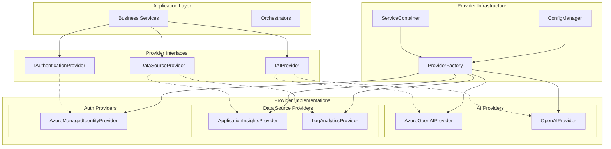
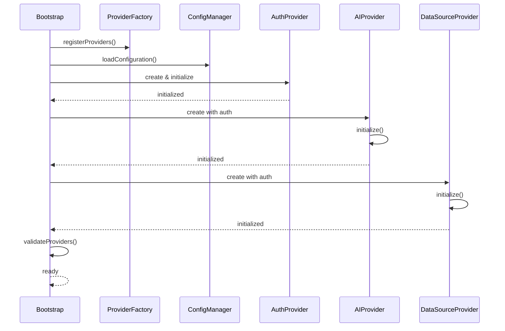

# Provider Development Guide

This guide explains the AppInsights Detective provider system and provides comprehensive instructions for creating custom providers. The provider system enables extensible integrations with different AI services, data sources, and authentication mechanisms.

## Table of Contents
- [Provider System Overview](#provider-system-overview)
- [Provider Types](#provider-types)
- [Creating New Providers](#creating-new-providers)
- [Provider Configuration](#provider-configuration)
- [Provider Lifecycle](#provider-lifecycle)
- [Example Implementation](#example-implementation)
- [Best Practices](#best-practices)
- [Testing Guidelines](#testing-guidelines)

## Provider System Overview

The provider system is a core architectural component that enables AppInsights Detective to work with multiple external services through a unified interface. This design promotes:

- **Extensibility**: Easy addition of new service integrations
- **Flexibility**: Runtime provider selection based on configuration
- **Testability**: Mock providers for testing
- **Maintainability**: Clear separation of integration concerns

### Provider Architecture



### Benefits of the Provider Pattern

1. **Modularity**: Each provider is self-contained and independent
2. **Configurability**: Providers can be selected and configured at runtime
3. **Testability**: Easy to mock providers for unit testing
4. **Extensibility**: New providers can be added without changing core logic
5. **Maintainability**: Clear boundaries and responsibilities

## Provider Types

### AI Providers

AI Providers handle natural language processing tasks including query generation, explanation, and result analysis.

#### Interface Definition

```typescript
// /src/core/interfaces/IAIProvider.ts
export interface IAIProvider {
  /**
   * Initialize the AI provider
   */
  initialize(): Promise<void>;

  /**
   * Generate KQL query from natural language
   */
  generateQuery(request: QueryGenerationRequest): Promise<NLQuery>;

  /**
   * Explain a KQL query in natural language
   */
  explainQuery(request: QueryExplanationRequest): Promise<string>;

  /**
   * Regenerate query with additional context
   */
  regenerateQuery(request: RegenerationRequest): Promise<NLQuery>;

  /**
   * Generate generic response for analysis
   */
  generateResponse(prompt: string): Promise<string>;

  /**
   * Analyze query results and provide insights
   */
  analyzeQueryResult(request: QueryAnalysisRequest): Promise<QueryAnalysisResult>;
}
```

#### Request/Response Types

```typescript
export interface QueryGenerationRequest {
  userInput: string;
  schema?: any;
  language?: SupportedLanguage;
}

export interface QueryAnalysisRequest {
  result: any;
  originalQuery: string;
  analysisType: 'patterns' | 'anomalies' | 'insights' | 'full';
  options?: {
    language?: SupportedLanguage;
  };
}

export interface QueryAnalysisResult {
  patterns?: {
    name: string;
    description: string;
    confidence: number;
    dataPoints: {
      timestamp: string;
      value: any;
      significance: 'high' | 'medium' | 'low';
    }[];
  }[];
  aiInsights?: string;
  recommendations?: string[];
  followUpQueries?: {
    query: string;
    purpose: string;
    priority: 'high' | 'medium' | 'low';
  }[];
}
```

#### Implementation Requirements

- **Authentication Handling**: Support for API keys, Azure authentication
- **Error Handling**: Graceful error handling with meaningful messages
- **Rate Limiting**: Implement appropriate rate limiting and retry logic
- **Model Configuration**: Support for different models and parameters
- **Context Management**: Maintain conversation context when applicable

#### Current AI Providers

**Azure OpenAI Provider** (`/src/providers/ai/AzureOpenAIProvider.ts`)
- Uses Azure OpenAI Service
- Supports Azure Managed Identity authentication
- Configurable deployment names and models

**OpenAI Provider** (`/src/providers/ai/OpenAIProvider.ts`)
- Uses OpenAI API directly
- API key authentication
- Supports various OpenAI models

### Data Source Providers

Data Source Providers execute queries against different data sources and return structured results.

#### Interface Definition

```typescript
// /src/core/interfaces/IDataSourceProvider.ts
export interface IDataSourceProvider {
  /**
   * Execute a query against the data source
   */
  executeQuery(request: QueryExecutionRequest): Promise<QueryResult>;

  /**
   * Validate connection to the data source
   */
  validateConnection(): Promise<ValidationResult>;

  /**
   * Get schema information for query generation
   */
  getSchema(): Promise<SchemaResult>;

  /**
   * Get metadata about the data source
   */
  getMetadata(): Promise<MetadataResult>;
}
```

#### Request/Response Types

```typescript
export interface QueryExecutionRequest {
  query: string;
  timeout?: number;
  timespan?: string;
}

export interface ValidationResult {
  isValid: boolean;
  error?: string;
}

export interface SchemaResult {
  tables?: string[];
  schema?: any;
  error?: string;
}

export interface MetadataResult {
  name?: string;
  type?: string;
  properties?: Record<string, any>;
  metadata?: any;
  error?: string;
}
```

#### Implementation Requirements

- **Query Execution**: Execute queries with proper timeout handling
- **Schema Discovery**: Provide schema information for AI query generation
- **Connection Validation**: Verify connectivity and permissions
- **Error Handling**: Handle query errors and connection issues
- **Result Formatting**: Return consistent result structures

#### Current Data Source Providers

**Application Insights Provider** (`/src/providers/datasource/ApplicationInsightsProvider.ts`)
- Executes KQL queries against Application Insights
- Uses Application Insights REST API
- Supports Azure authentication

**Log Analytics Provider** (`/src/providers/datasource/LogAnalyticsProvider.ts`)
- Executes KQL queries against Log Analytics workspaces
- Uses Azure Monitor REST API
- Workspace-based authentication

### Authentication Providers

Authentication Providers handle credential management and token acquisition for Azure services.

#### Interface Definition

```typescript
// /src/core/interfaces/IAuthenticationProvider.ts
export interface IAuthenticationProvider {
  /**
   * Get access token for specified scopes
   */
  getAccessToken(scopes: string[]): Promise<string>;

  /**
   * Validate current credentials
   */
  validateCredentials(): Promise<boolean>;

  /**
   * Get token specifically for OpenAI/AI services
   */
  getOpenAIToken(): Promise<string>;
}
```

#### Implementation Requirements

- **Token Management**: Handle token caching and refresh
- **Scope Handling**: Support different Azure scopes
- **Error Handling**: Graceful authentication error handling
- **Credential Validation**: Verify credentials before use

#### Current Authentication Providers

**Azure Managed Identity Provider** (`/src/providers/auth/AzureManagedIdentityProvider.ts`)
- Uses Azure DefaultAzureCredential
- Supports system and user-assigned managed identities
- Automatic token refresh

## Creating New Providers

### Step-by-Step Provider Creation Guide

#### 1. Define Provider Type

First, decide which type of provider you're creating (AI, Data Source, or Authentication) and understand the interface requirements.

#### 2. Create Provider Class

Create a new provider class that implements the appropriate interface:

```typescript
// Example: /src/providers/ai/CustomAIProvider.ts
import { IAIProvider } from '../../core/interfaces/IAIProvider';
import { 
  QueryGenerationRequest, 
  QueryAnalysisRequest,
  QueryAnalysisResult 
} from '../../core/interfaces/IAIProvider';
import { NLQuery } from '../../types';
import { logger } from '../../utils/logger';

export class CustomAIProvider implements IAIProvider {
  private initialized = false;
  
  constructor(
    private config: CustomAIProviderConfig,
    private authProvider?: IAuthenticationProvider
  ) {}

  async initialize(): Promise<void> {
    logger.info('Initializing Custom AI Provider');
    
    // Initialize your provider (setup clients, validate config, etc.)
    try {
      // Initialization logic here
      this.initialized = true;
      logger.info('Custom AI Provider initialized successfully');
    } catch (error) {
      logger.error('Failed to initialize Custom AI Provider', error);
      throw error;
    }
  }

  async generateQuery(request: QueryGenerationRequest): Promise<NLQuery> {
    if (!this.initialized) {
      throw new Error('Provider not initialized');
    }

    logger.info(`Generating KQL query for: "${request.userInput}"`);
    
    try {
      // Your query generation logic here
      const generatedKQL = await this.callCustomAPI(request);
      
      return {
        userInput: request.userInput,
        generatedKQL,
        reasoning: 'Generated by Custom AI Provider',
        confidence: 0.85
      };
    } catch (error) {
      logger.error('Failed to generate KQL query', error);
      throw error;
    }
  }

  async explainQuery(request: QueryExplanationRequest): Promise<string> {
    // Implementation details...
  }

  async regenerateQuery(request: RegenerationRequest): Promise<NLQuery> {
    // Implementation details...
  }

  async generateResponse(prompt: string): Promise<string> {
    // Implementation details...
  }

  async analyzeQueryResult(request: QueryAnalysisRequest): Promise<QueryAnalysisResult> {
    // Implementation details...
  }

  private async callCustomAPI(request: QueryGenerationRequest): Promise<string> {
    // Your custom API integration logic
  }
}
```

#### 3. Define Configuration Schema

Create a configuration interface for your provider:

```typescript
// Add to /src/core/types/ProviderTypes.ts
export interface CustomAIProviderConfig extends AIProviderConfig {
  type: 'custom-ai';
  apiKey: string;
  endpoint: string;
  model?: string;
  temperature?: number;
  maxTokens?: number;
}
```

#### 4. Register Provider Constructor

Register your provider in the Bootstrap class:

```typescript
// In /src/infrastructure/Bootstrap.ts
import { CustomAIProvider } from '../providers/ai/CustomAIProvider';

export class Bootstrap {
  async initialize(): Promise<ServiceContainer> {
    // ... existing code ...
    
    // Register your custom provider
    this.providerFactory.registerAIProvider('custom-ai', CustomAIProvider);
    
    // ... rest of initialization ...
  }
}
```

#### 5. Update Type Definitions

Add your provider type to the appropriate type union:

```typescript
// In /src/core/types/ProviderTypes.ts
export type AIProviderType = 
  | 'azure-openai' 
  | 'openai'
  | 'custom-ai';  // Add your provider type
```

#### 6. Add Configuration Validation

Add validation logic for your provider configuration:

```typescript
// In /src/utils/providerValidation.ts
export class ProviderConfigValidator {
  static validateAIProvider(type: AIProviderType, config: any): ValidationResult {
    switch (type) {
      case 'custom-ai':
        return this.validateCustomAIProvider(config);
      // ... other cases ...
    }
  }

  private static validateCustomAIProvider(config: any): ValidationResult {
    const result: ValidationResult = { isValid: true };
    
    if (!config.apiKey) {
      result.isValid = false;
      result.errors = result.errors || [];
      result.errors.push('Custom AI API key is required');
    }
    
    if (!config.endpoint) {
      result.isValid = false;
      result.errors = result.errors || [];
      result.errors.push('Custom AI endpoint is required');
    }
    
    return result;
  }
}
```

### Testing New Providers

#### Unit Tests

Create comprehensive unit tests for your provider:

```typescript
// /tests/providers/customAIProvider.test.ts
import { CustomAIProvider } from '../../src/providers/ai/CustomAIProvider';

describe('CustomAIProvider', () => {
  let provider: CustomAIProvider;
  
  beforeEach(() => {
    provider = new CustomAIProvider({
      type: 'custom-ai',
      apiKey: 'test-key',
      endpoint: 'https://api.example.com'
    });
  });

  describe('initialize', () => {
    it('should initialize successfully with valid config', async () => {
      await expect(provider.initialize()).resolves.not.toThrow();
    });
  });

  describe('generateQuery', () => {
    it('should generate KQL query from natural language', async () => {
      await provider.initialize();
      
      const result = await provider.generateQuery({
        userInput: 'show me errors from the last hour'
      });
      
      expect(result).toMatchObject({
        userInput: 'show me errors from the last hour',
        generatedKQL: expect.any(String),
        confidence: expect.any(Number)
      });
    });
  });
});
```

#### Integration Tests

Create integration tests that verify provider functionality with real services:

```typescript
// /tests/integration/customAIProvider.integration.test.ts
describe('CustomAIProvider Integration', () => {
  it('should work with real API', async () => {
    // Integration test implementation
  });
});
```

## Provider Configuration

### Configuration File Structure

Providers are configured in the main configuration file using the provider-based structure:

```json
{
  "providers": {
    "ai": {
      "default": "custom-ai",
      "custom-ai": {
        "type": "custom-ai",
        "apiKey": "your-api-key",
        "endpoint": "https://api.example.com",
        "model": "custom-model-v1",
        "temperature": 0.7,
        "maxTokens": 2000
      }
    },
    "dataSources": {
      "default": "application-insights",
      "application-insights": {
        "type": "application-insights",
        "applicationId": "your-app-id",
        "tenantId": "your-tenant-id"
      }
    },
    "auth": {
      "default": "azure-managed-identity",
      "azure-managed-identity": {
        "type": "azure-managed-identity",
        "tenantId": "your-tenant-id"
      }
    }
  }
}
```

### Environment Variables

Providers can also be configured using environment variables:

```bash
# Custom AI Provider
CUSTOM_AI_API_KEY=your-api-key
CUSTOM_AI_ENDPOINT=https://api.example.com
CUSTOM_AI_MODEL=custom-model-v1
```

### Runtime Configuration Updates

Providers support runtime configuration updates through the configuration management system:

```typescript
// Example: Update provider configuration at runtime
const configManager = container.resolve<ConfigManager>('configManager');
await configManager.updateProviderConfig('ai', 'custom-ai', newConfig);
```

## Provider Lifecycle

### Initialization Process



### Provider States

1. **Unregistered**: Provider constructor not registered with factory
2. **Registered**: Constructor registered but not instantiated
3. **Created**: Instance created but not initialized
4. **Initializing**: Provider running initialization logic
5. **Ready**: Provider initialized and ready for use
6. **Error**: Provider failed initialization or encountered error
7. **Disposed**: Provider resources cleaned up

### Error Handling and Fallback Strategies

#### Graceful Degradation

```typescript
class QueryService {
  async executeQuery(request: QueryServiceRequest): Promise<QueryServiceResult> {
    try {
      return await this.orchestrator.executeNaturalLanguageQuery(request);
    } catch (error) {
      if (this.isProviderError(error)) {
        // Try fallback provider if available
        return await this.tryFallbackProvider(request);
      }
      throw error;
    }
  }

  private async tryFallbackProvider(request: QueryServiceRequest): Promise<QueryServiceResult> {
    const fallbackProvider = this.getFallbackProvider();
    if (fallbackProvider) {
      logger.warn('Primary provider failed, trying fallback provider');
      return await fallbackProvider.executeQuery(request);
    }
    throw new Error('No fallback provider available');
  }
}
```

#### Circuit Breaker Pattern

```typescript
class ProviderCircuitBreaker {
  private failures = 0;
  private lastFailureTime = 0;
  private isOpen = false;

  async execute<T>(operation: () => Promise<T>): Promise<T> {
    if (this.isCircuitOpen()) {
      throw new Error('Circuit breaker is open');
    }

    try {
      const result = await operation();
      this.onSuccess();
      return result;
    } catch (error) {
      this.onFailure();
      throw error;
    }
  }
}
```

#### Resource Cleanup

```typescript
export abstract class BaseProvider {
  protected resources: Array<{ dispose(): Promise<void> }> = [];

  async dispose(): Promise<void> {
    logger.info(`Disposing provider: ${this.constructor.name}`);
    
    await Promise.all(
      this.resources.map(async (resource) => {
        try {
          await resource.dispose();
        } catch (error) {
          logger.warn('Failed to dispose resource', error);
        }
      })
    );
    
    this.resources.length = 0;
  }
}
```

## Example Implementation

Let's walk through a complete example of creating a custom Anthropic AI provider:

### 1. Provider Implementation

```typescript
// /src/providers/ai/AnthropicProvider.ts
import { IAIProvider } from '../../core/interfaces/IAIProvider';
import { 
  QueryGenerationRequest,
  QueryAnalysisRequest,
  QueryAnalysisResult,
  QueryExplanationRequest,
  RegenerationRequest
} from '../../core/interfaces/IAIProvider';
import { NLQuery } from '../../types';
import { logger } from '../../utils/logger';
import axios from 'axios';

interface AnthropicConfig {
  type: 'anthropic';
  apiKey: string;
  model?: string;
  maxTokens?: number;
  temperature?: number;
}

export class AnthropicProvider implements IAIProvider {
  private client: any;
  private initialized = false;

  constructor(
    private config: AnthropicConfig,
    private authProvider?: IAuthenticationProvider
  ) {}

  async initialize(): Promise<void> {
    logger.info('Initializing Anthropic Provider');
    
    try {
      // Validate configuration
      if (!this.config.apiKey) {
        throw new Error('Anthropic API key is required');
      }

      // Initialize Anthropic client (pseudo-code - actual implementation would use Anthropic SDK)
      this.client = axios.create({
        baseURL: 'https://api.anthropic.com/v1',
        headers: {
          'Authorization': `Bearer ${this.config.apiKey}`,
          'Content-Type': 'application/json'
        }
      });

      this.initialized = true;
      logger.info('Anthropic Provider initialized successfully');
    } catch (error) {
      logger.error('Failed to initialize Anthropic Provider', error);
      throw error;
    }
  }

  async generateQuery(request: QueryGenerationRequest): Promise<NLQuery> {
    if (!this.initialized) {
      throw new Error('Anthropic provider not initialized');
    }

    logger.info(`Generating KQL query for: "${request.userInput}"`);

    const prompt = this.buildQueryGenerationPrompt(request);

    try {
      const response = await this.client.post('/messages', {
        model: this.config.model || 'claude-3-sonnet-20240229',
        max_tokens: this.config.maxTokens || 1000,
        temperature: this.config.temperature || 0.7,
        messages: [
          {
            role: 'user',
            content: prompt
          }
        ]
      });

      const generatedKQL = this.extractKQLFromResponse(response.data);
      
      return {
        userInput: request.userInput,
        generatedKQL,
        reasoning: 'Generated using Anthropic Claude',
        confidence: 0.8
      };
    } catch (error) {
      logger.error('Failed to generate KQL query using Anthropic', error);
      throw new Error('Anthropic query generation failed');
    }
  }

  async explainQuery(request: QueryExplanationRequest): Promise<string> {
    if (!this.initialized) {
      throw new Error('Anthropic provider not initialized');
    }

    const prompt = `Please explain this KQL query in simple terms:\n\n${request.query}`;

    try {
      const response = await this.client.post('/messages', {
        model: this.config.model || 'claude-3-sonnet-20240229',
        max_tokens: 500,
        messages: [
          {
            role: 'user',
            content: prompt
          }
        ]
      });

      return response.data.content[0].text;
    } catch (error) {
      logger.error('Failed to explain query using Anthropic', error);
      throw new Error('Query explanation failed');
    }
  }

  async regenerateQuery(request: RegenerationRequest): Promise<NLQuery> {
    // Implementation similar to generateQuery but with additional context
    return this.generateQuery({
      userInput: `${request.userInput}\n\nAdditional context: ${JSON.stringify(request.context)}`,
      schema: request.schema,
      language: request.language
    });
  }

  async generateResponse(prompt: string): Promise<string> {
    if (!this.initialized) {
      throw new Error('Anthropic provider not initialized');
    }

    try {
      const response = await this.client.post('/messages', {
        model: this.config.model || 'claude-3-sonnet-20240229',
        max_tokens: 1000,
        messages: [
          {
            role: 'user',
            content: prompt
          }
        ]
      });

      return response.data.content[0].text;
    } catch (error) {
      logger.error('Failed to generate response using Anthropic', error);
      throw new Error('Response generation failed');
    }
  }

  async analyzeQueryResult(request: QueryAnalysisRequest): Promise<QueryAnalysisResult> {
    const analysisPrompt = this.buildAnalysisPrompt(request);
    
    try {
      const response = await this.generateResponse(analysisPrompt);
      return this.parseAnalysisResponse(response);
    } catch (error) {
      logger.error('Failed to analyze query result using Anthropic', error);
      throw error;
    }
  }

  private buildQueryGenerationPrompt(request: QueryGenerationRequest): string {
    return `
Generate a KQL query for Azure Application Insights based on this request: "${request.userInput}"

Please follow these guidelines:
- Use appropriate KQL syntax and operators
- Include proper time range filters when relevant
- Focus on the specific data the user is asking for
- Return only the KQL query without additional explanation

${request.schema ? `Available tables and schema: ${JSON.stringify(request.schema)}` : ''}
`;
  }

  private extractKQLFromResponse(response: any): string {
    // Extract KQL from Anthropic response format
    const content = response.content[0].text;
    
    // Look for KQL code blocks or clean text
    const kqlMatch = content.match(/```(?:kql)?\n([\s\S]*?)\n```/);
    if (kqlMatch) {
      return kqlMatch[1].trim();
    }
    
    return content.trim();
  }

  private buildAnalysisPrompt(request: QueryAnalysisRequest): string {
    return `
Analyze the following query results and provide insights:

Original Query: ${request.originalQuery}
Results: ${JSON.stringify(request.result, null, 2)}
Analysis Type: ${request.analysisType}

Please provide:
1. Key patterns or trends in the data
2. Notable anomalies or outliers  
3. Business insights and recommendations
4. Suggested follow-up queries

Format your response as JSON with the following structure:
{
  "patterns": [{"name": "", "description": "", "confidence": 0-1}],
  "aiInsights": "",
  "recommendations": [""],
  "followUpQueries": [{"query": "", "purpose": "", "priority": "high|medium|low"}]
}
`;
  }

  private parseAnalysisResponse(response: string): QueryAnalysisResult {
    try {
      return JSON.parse(response);
    } catch (error) {
      // Fallback if JSON parsing fails
      return {
        aiInsights: response,
        recommendations: [],
        followUpQueries: []
      };
    }
  }
}
```

### 2. Configuration Schema

```typescript
// Add to /src/core/types/ProviderTypes.ts
export interface AnthropicConfig extends AIProviderConfig {
  type: 'anthropic';
  apiKey: string;
  model?: string;
  maxTokens?: number;
  temperature?: number;
}

export type AIProviderType = 
  | 'azure-openai' 
  | 'openai'
  | 'anthropic';
```

### 3. Provider Registration

```typescript
// In /src/infrastructure/Bootstrap.ts
import { AnthropicProvider } from '../providers/ai/AnthropicProvider';

export class Bootstrap {
  async initialize(): Promise<ServiceContainer> {
    // ... existing code ...
    
    this.providerFactory.registerAIProvider('anthropic', AnthropicProvider);
    
    // ... rest of initialization ...
  }
}
```

### 4. Configuration Validation

```typescript
// In /src/utils/providerValidation.ts
export class ProviderConfigValidator {
  static validateAIProvider(type: AIProviderType, config: any): ValidationResult {
    switch (type) {
      case 'anthropic':
        return this.validateAnthropicProvider(config);
      // ... other cases ...
    }
  }

  private static validateAnthropicProvider(config: any): ValidationResult {
    const result: ValidationResult = { isValid: true };
    
    if (!config.apiKey) {
      result.isValid = false;
      result.errors = result.errors || [];
      result.errors.push('Anthropic API key is required');
    }
    
    if (config.model && !['claude-3-opus-20240229', 'claude-3-sonnet-20240229', 'claude-3-haiku-20240307'].includes(config.model)) {
      result.warnings = result.warnings || [];
      result.warnings.push('Specified Anthropic model may not be supported');
    }
    
    return result;
  }
}
```

### 5. Usage Configuration

```json
{
  "providers": {
    "ai": {
      "default": "anthropic",
      "anthropic": {
        "type": "anthropic",
        "apiKey": "${ANTHROPIC_API_KEY}",
        "model": "claude-3-sonnet-20240229",
        "temperature": 0.7,
        "maxTokens": 1500
      }
    }
  }
}
```

## Best Practices

### 1. Error Handling

Always implement comprehensive error handling:

```typescript
export class BestPracticeProvider implements IAIProvider {
  async generateQuery(request: QueryGenerationRequest): Promise<NLQuery> {
    try {
      // Implementation
    } catch (error) {
      // Log the error with context
      logger.error('Query generation failed', {
        error: error.message,
        userInput: request.userInput,
        provider: this.constructor.name
      });
      
      // Throw with meaningful message
      throw new Error(`Query generation failed: ${error.message}`);
    }
  }
}
```

### 2. Configuration Validation

Validate configuration early and provide clear error messages:

```typescript
export class BestPracticeProvider {
  constructor(private config: ProviderConfig) {
    this.validateConfig(config);
  }

  private validateConfig(config: ProviderConfig): void {
    if (!config.apiKey) {
      throw new Error('API key is required for provider');
    }
    
    if (config.timeout && config.timeout < 1000) {
      logger.warn('Timeout is very low, may cause failures');
    }
  }
}
```

### 3. Resource Management

Properly manage resources and provide cleanup:

```typescript
export class BestPracticeProvider {
  private httpClient?: any;
  private disposed = false;

  async initialize(): Promise<void> {
    this.httpClient = this.createHttpClient();
  }

  async dispose(): Promise<void> {
    if (this.disposed) return;

    if (this.httpClient) {
      await this.httpClient.dispose();
      this.httpClient = null;
    }

    this.disposed = true;
  }
}
```

### 4. Logging and Monitoring

Include appropriate logging for observability:

```typescript
export class BestPracticeProvider {
  async generateQuery(request: QueryGenerationRequest): Promise<NLQuery> {
    const startTime = Date.now();
    
    logger.info('Starting query generation', {
      userInput: request.userInput,
      provider: this.constructor.name
    });

    try {
      const result = await this.performGeneration(request);
      
      logger.info('Query generation successful', {
        executionTime: Date.now() - startTime,
        confidence: result.confidence
      });
      
      return result;
    } catch (error) {
      logger.error('Query generation failed', {
        executionTime: Date.now() - startTime,
        error: error.message
      });
      throw error;
    }
  }
}
```

### 5. Configuration Flexibility

Support multiple configuration methods:

```typescript
export class BestPracticeProvider {
  constructor(config: ProviderConfig) {
    // Support environment variable overrides
    this.config = {
      ...config,
      apiKey: process.env.PROVIDER_API_KEY || config.apiKey,
      endpoint: process.env.PROVIDER_ENDPOINT || config.endpoint
    };
  }
}
```

## Testing Guidelines

### Unit Testing

```typescript
describe('CustomProvider', () => {
  let provider: CustomProvider;
  let mockConfig: CustomProviderConfig;

  beforeEach(() => {
    mockConfig = {
      type: 'custom',
      apiKey: 'test-key',
      endpoint: 'https://test.api.com'
    };
    provider = new CustomProvider(mockConfig);
  });

  describe('initialization', () => {
    it('should initialize with valid configuration', async () => {
      await expect(provider.initialize()).resolves.not.toThrow();
    });

    it('should throw error with invalid configuration', async () => {
      const invalidProvider = new CustomProvider({ 
        ...mockConfig, 
        apiKey: '' 
      });
      
      await expect(invalidProvider.initialize()).rejects.toThrow('API key is required');
    });
  });

  describe('query generation', () => {
    beforeEach(async () => {
      await provider.initialize();
    });

    it('should generate query from user input', async () => {
      const result = await provider.generateQuery({
        userInput: 'show me errors'
      });

      expect(result).toMatchObject({
        userInput: 'show me errors',
        generatedKQL: expect.any(String),
        confidence: expect.any(Number)
      });
    });
  });
});
```

### Integration Testing

```typescript
describe('CustomProvider Integration', () => {
  let provider: CustomProvider;

  beforeAll(async () => {
    // Setup with real configuration for integration tests
    provider = new CustomProvider({
      type: 'custom',
      apiKey: process.env.CUSTOM_API_KEY!,
      endpoint: process.env.CUSTOM_ENDPOINT!
    });
    
    await provider.initialize();
  });

  it('should work with real API', async () => {
    const result = await provider.generateQuery({
      userInput: 'show application errors from last hour'
    });

    expect(result.generatedKQL).toBeTruthy();
    expect(result.confidence).toBeGreaterThan(0);
  });
});
```

### Mock Provider for Testing

```typescript
export class MockAIProvider implements IAIProvider {
  async initialize(): Promise<void> {
    // Mock initialization
  }

  async generateQuery(request: QueryGenerationRequest): Promise<NLQuery> {
    return {
      userInput: request.userInput,
      generatedKQL: 'exceptions | where timestamp > ago(1h)',
      reasoning: 'Mock query for testing',
      confidence: 0.9
    };
  }

  // ... implement other methods with mock responses
}
```

This comprehensive guide should provide developers with everything they need to understand and extend the AppInsights Detective provider system. The modular architecture makes it easy to add new providers while maintaining consistency and reliability across the system.